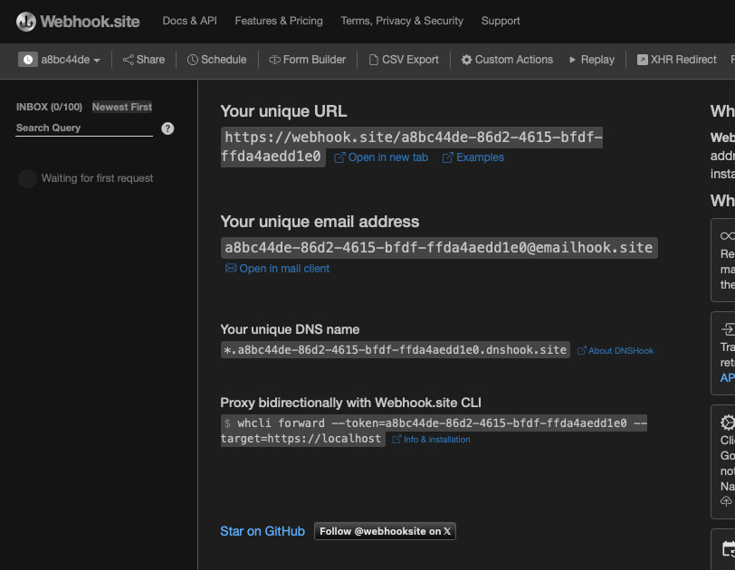
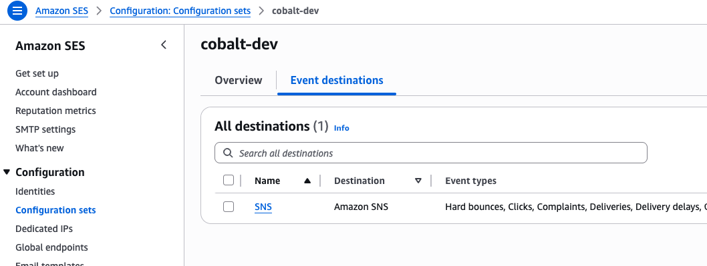
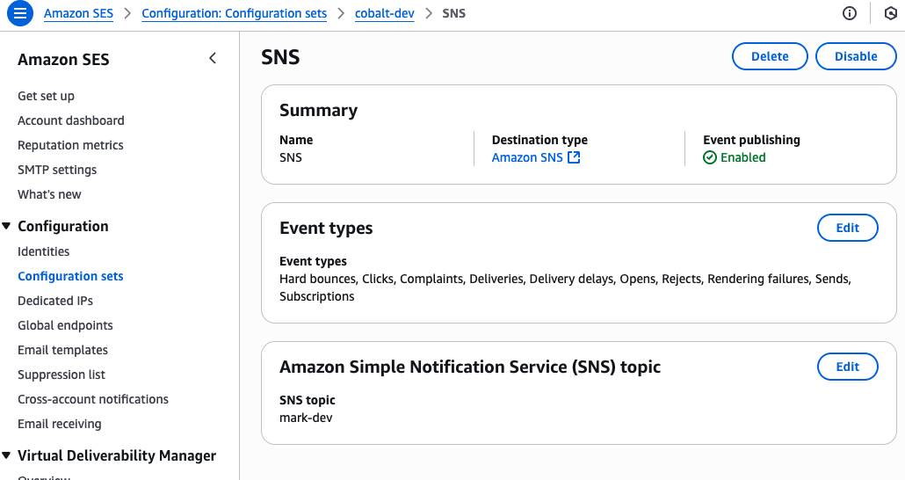
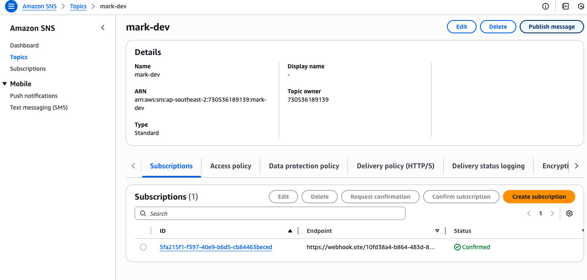
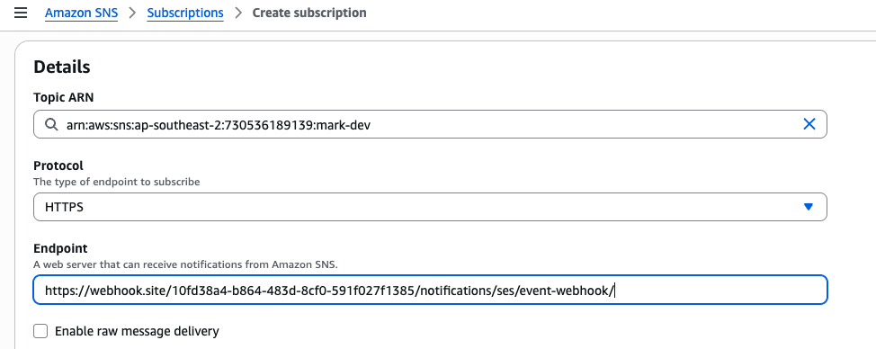
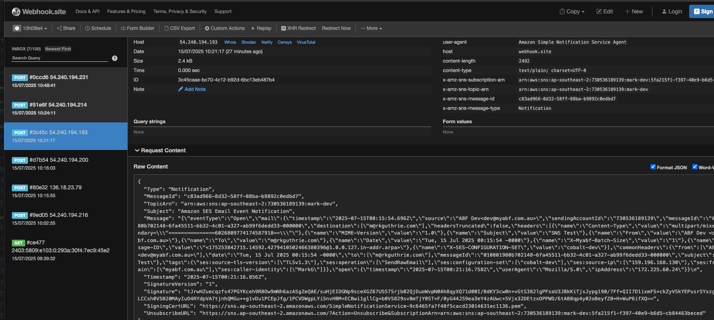
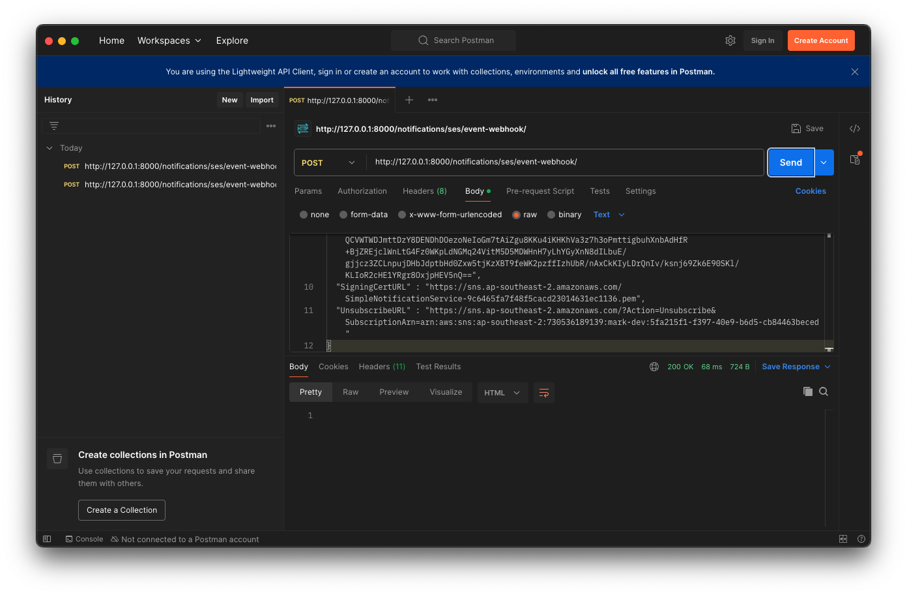

:orphan:

.. image:: ../../images/cobalt.jpg
 :width: 300
 :alt: Cobalt Chemical Symbol

==================================
Adding Email to Cobalt
==================================

For the ABF deployment, we use AWS Simple Email Service (SES). This has callbacks so
we know when an email is delivered and opened. This doesn't work in development, as you
need an internet facing web server to receive the callback.

For an overview of why email is set up as it is, see  :doc:`../tutorials/aws_overview`.

Pre-requisites
==============

First, set up your basic Cobalt environment on AWS (see :doc:`../tutorials/getting_started`
and :doc:`../tutorials/aws_overview`).

You need a basic AWS set up to start with and you need SES enabled. This is already well documented,
although it is not that straightforward and involves getting permission from Amazon.
If you can get to the point where you can send email from your Cobalt system (or anything else)
using SMTP then that is a fine starting point for this.

.. admonition:: Environments

    While there is no such thing as a non-production email account, we are able to separate the
    SES infrastructure for each environment (Test, UAT and Production). Testing of return messages
    from SES is not possible in Development. To do any significant work in Development it is
    recommended that you run up a temporary server on the Internet to use as a development machine.

Add a Configuration Set
=======================

#. Create a Configuration Set - name it after the environment e.g. cobalt-test
#. Add Destination - SNS
#. Create new SNS Topic - again name it after the environment
#. Select all event types (except Rendering Failure).
#. Use the AWS domain for click and open tracking
#. Now go to SNS and find you topic
#. Add a subscriber and choose HTTPS with the Django URL, e.g. https://test.myabf.com.au/notifications/ses/event-webhook/
#. Django SES will handle the subscription request and this will now be set up
#. Add environment variables for your Cobalt system. You will need: AWS_SES_REGION_NAME, AWS_SES_REGION_ENDPOINT and AWS_SES_CONFIGURATION_SET as well as the AWS credentials.

Environment Variables
=====================

Add environment variables to your environment::

    EMAIL_HOST=email-smtp.ap-southeast-2.amazonaws.com
    EMAIL_HOST_PASSWORD=somepassword
    EMAIL_HOST_USER=someuser

    # next lines not needed for development
    AWS_SES_REGION_ENDPOINT=email.ap-southeast-2.amazonaws.com
    AWS_SES_CONFIGURATION_SET = set_value("AWS_SES_CONFIGURATION_SET")
    AWS_REGION_NAME=yourregion
    AWS_SES_REGION_ENDPOINT=endpoint

    # Additionally, set the default email to an email address in your domain
    DEFAULT_FROM_EMAIL=ABF Dev<dev@myabf.com.au>

Using Another Email Provider
============================

To use another provider instead of AWS, you need to set the EMAIL_HOST, EMAIL_HOST_USER and EMAIL_HOST_PASSWORD
environment variable.

You will also need to direct Django Post Office to use your email backend instead of Django SES.

Change this section of cobalt/settings.py to an appropriate value::

    POST_OFFICE = {
        "BACKENDS": {
            "default": "django_ses.SESBackend",
        },
    ...
    }

Testing the Webhook
===================

In Test or UAT, you can test the webhook call back from AWS SES just by turning off the playpen setting,
`DISABLE_PLAYPEN=ON`, and sending an email.

If you want to test the webhook in a development environment, you can follow these steps.

Webhook.site
------------

Go to https://webhook.site and create a temporary, free URL.

AWS Set Up
----------

Check what configuration set your development environment is pointing to.::

    $ env | grep AWS_SES
    AWS_SES_CONFIGURATION_SET=cobalt-dev

In the AWS console see what Simple Notification Service (SNS) this points to.

|

Follow the link to see the SNS topic.

|

Go to the SNS Console and look at this topic.

|

Delete any old subscriptions and add a new one.

Choose HTTPS and enter your endpoint::

    https://webhook.site/<YOUR VALUE>/notifications/ses/event-webhook/

Confirm Subscription
---------------------

Return to webhook.site and you should see a message on the left. The following
screen shot shows several, but at this stage you should only have one.

This will have a URL in it that you need to visit to activate your subscription.

Sending Emails
--------------

You can now send emails from your development environment.

- DISABLE_PLAYPEN=ON
- Set a real email address for a user
- Send an email to that user from another user e.g. http://127.0.0.1:8000/notifications/member-to-member-email/<member-id>
- Run the email batch job `./manage.py post_office_email_sender_cron`

Postman
-------

When you send an email (or read it etc), the messages from SES will collect in webhook.site. You can use curl or other tools
to send these into your development version of Cobalt.

Postman (https://www.postman.com/downloads/) is good for this.

You can paste your messages in Postman from webhook.site.

The URL will be something like: `http://127.0.0.1:8000/notifications/ses/event-webhook/`