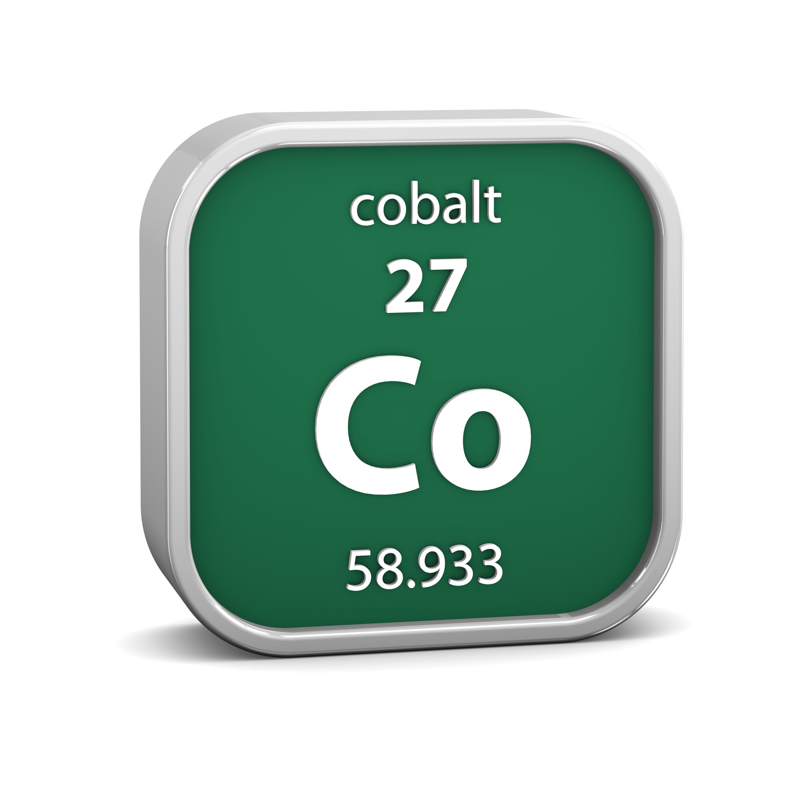

:orphan:

=======================================
How To Load Production Data into Test
=======================================

There are two options here, using the same database server and creating a new
one.

Same Database Server
====================

This option is quicker, but less thorough. Use this if you don't care about integrity
(copy doesn't come from a snapshot so data in different tables can be out of step, e.g.
event entries without the matching payments). Also don't use this if you need the
file system (well, you can but the steps are not included).

Get Connection Parameters
-------------------------

Get the values for Production::

    eb printenv cobalt-production-blue | grep RDS | tr -d " " | awk '{print "export", $1}'
    export RDS_DB_NAME=********
    export RDS_HOSTNAME=production-blue.c97jawiow7ed.ap-southeast-2.rds.amazonaws.com
    export RDS_PASSWORD=*******
    export RDS_PORT=5432
    export RDS_USERNAME=******

Connect to the Test instance::

    eb ssh cobalt-test-white

    test.myabf.com.au
       ________                     __
      /        |                   /  |
      $$$$$$$$/______    _______  _$$ |_
         $$ | /      \  /       |/ $$   |
         $$ |/$$$$$$  |/$$$$$$$/ $$$$$$/
         $$ |$$    $$ |$$      \   $$ | __
         $$ |$$$$$$$$/  $$$$$$  |  $$ |/  |
         $$ |$$       |/     $$/   $$  $$/
         $$/  $$$$$$$/ $$$$$$$/     $$$$/

    ((staging) ) [root@ip-172-31-46-24 current]#

Set the environment variables to have the same credentials as Production by pasting the output
of the box two above.

Also set the variable PGPASSWORD to the database password, this is used by pg_dump::

    export PGPASSWORD=$RDS_PASSWORD

Set the dump file location - you may need to use the NFS file system if there is too
much data (including the emails), otherwise you can use the local file system::

    export DUMP_FILE=~/dump_file
    # or
    export DUMP_FILE=/cobalt-media/delete-me-later

Run pg_dump
-----------

If you don't want the emails (they are huge) then run this::

    pg_dump -h "$RDS_HOSTNAME" -p 5432 -d "$RDS_DB_NAME" -U "$RDS_USERNAME" -F c -b -v -f "$DUMP_FILE" \
                     --exclude-table-data "public.notifications_abstractemail" \
                     --exclude-table-data "public.post_office_*"

If you do want the emails run this::

    pg_dump -h "$RDS_HOSTNAME" -p 5432 -d "$RDS_DB_NAME" -U "$RDS_USERNAME" -F c -b -v -f "$DUMP_FILE"

Clean Up
--------

Now logout of your session to lose the production variables, and log back in. Now there is
no chance to mess production up.

.. danger::
    Make sure you have got rid of the Production credentials before you do anything else.

Connect to the Test instance::

    eb ssh cobalt-test-white

Set up Database
----------------

Now connect to the database server::

    ./manage.py dbshell
    psql (17.5, server 17.4)
    SSL connection (protocol: TLSv1.3, cipher: TLS_AES_256_GCM_SHA384, compression: off, ALPN: postgresql)
    Type "help" for help.

    white=>

You can list the databases that are available::

    white=> \l

Remember that Test and UAT share a database server.

If you need to drop an old copy of the database run::

    white=> drop database test_prod_load;

Create a new database::

    white=> create database test_prod_load with owner postgres;

Make the owner the same as the `RDS_USERNAME` for your system.

Restore Database
----------------

Now do the restore::

    pg_restore -h "$RDS_HOSTNAME" -p 5432 -U "$RDS_USERNAME" -d test_prod_load --no-owner --no-privileges --role=cobalt -v ~/dump_file

Set the -d (database) option to the database you just created, and the last parameter (dump file)
to the file you created.

Sanitise Data
-------------

You may need to update the database if there are model changes in Test that were not
in production::

    ./manage.py migrate

Now run::

    export RDS_DB_NAME=test_prod_load   # or whatever you set up
    ./manage.py sanitise_production_data_for_testing

Update Elastic Beanstalk
------------------------

Login to the AWS console and change the RDS_DB_NAME for your environment to be the
new database you set up.

New Database Server
===================

You could dump the data from Production and load it into a new database on
the Test database server, but it is easier to do create a new database server
from a snapshot from the Production database.

Take a Snapshot
---------------

From the AWS RDS Console take a snapshot of the production database. If you
don't need the most recent data, you can use the last automatic snapshot.

Create Database From Snapshot
-----------------------------

In the AWS RDS Console select the Production database server and
go to the **Maintenance and Backups** tab.

Select your snapshot and click **Restore**.

Give it a name and make sure you chose an appropriate EC2 instance type e.g.
db.t3.micro. (You will need to change the selector to include Burstable classes.

Click **Restore DB instance**

Prepare the Database
--------------------

**Don't update Test to point to this database yet!!!**

If you do it may send emails to real users. This should be blocked by the
PLAYPEN setting, but its best to be careful.

Get the values for Production::

    eb printenv cobalt-production-green | grep RDS

     RDS_DB_NAME = ebdb
     RDS_HOSTNAME = cobalt-production.c97jawiow7ed.ap-southeast-2.rds.amazonaws.com
     RDS_PASSWORD = *********
     RDS_PORT = 5432
     RDS_USERNAME = postgres

Connect to the Test instance::

    eb ssh cobalt-test-black

    test.myabf.com.au
       ________                     __
      /        |                   /  |
      $$$$$$$$/______    _______  _$$ |_
         $$ | /      \  /       |/ $$   |
         $$ |/$$$$$$  |/$$$$$$$/ $$$$$$/
         $$ |$$    $$ |$$      \   $$ | __
         $$ |$$$$$$$$/  $$$$$$  |  $$ |/  |
         $$ |$$       |/     $$/   $$  $$/
         $$/  $$$$$$$/ $$$$$$$/     $$$$/

    ((staging) ) [root@ip-172-31-46-24 current]#

Set the environment variables to have the same credentials as Production::

    export RDS_DB_NAME=ebdb
    export RDS_PASSWORD=********
    export RDS_PORT=5432
    export RDS_USERNAME=postgres

Set the Hostname to be the name of your new database, e.g.::

    export RDS_HOSTNAME=prod-copy.c97jawiow7ed.ap-southeast-2.rds.amazonaws.com

Double check the variables to make sure you are connecting to the copy.

Change the password to be different from Production.::

    ./manage.py dbshell
    psql (9.2.24, server 12.19)
    WARNING: psql version 9.2, server version 12.0.
         Some psql features might not work.
    SSL connection (cipher: ECDHE-RSA-AES256-GCM-SHA384, bits: 256)
    Type "help" for help.

    ebdb=> ALTER USER postgres WITH PASSWORD 'notprod';
    ALTER ROLE
    ebdb=> \q

Check that you cannot connect to the database using the old password. e.g.::

    ./manage.py shell_plus

    Type "help", "copyright", "credits" or "license" for more information.
    (InteractiveConsole)
    >>> User.objects.count()

    File "/var/app/venv/staging-LQM1lest/lib/python3.7/site-packages/django/db/backends/postgresql/base.py", line 187, in get_new_connection
    connection = Database.connect(**conn_params)
    File "/var/app/venv/staging-LQM1lest/lib64/python3.7/site-packages/psycopg2/__init__.py", line 126, in connect
    conn = _connect(dsn, connection_factory=connection_factory, **kwasync)
    django.db.utils.OperationalError: FATAL:  password authentication failed for user "postgres"
    FATAL:  password authentication failed for user "postgres"

Change the password to the new value and check that you can connect.::

    export RDS_PASSWORD=notprod
    ./manage.py shell_plus

    Type "help", "copyright", "credits" or "license" for more information.
    (InteractiveConsole)
    >>> User.objects.count()
    16978

Before you change any data, take a manual snapshot of Production from the AWS RDS Console.
It can't do any harm.

Sanitize the Data
-----------------

You need to remove real email addresses and delete anything in the queues for Django Post Office.

Check that `tests/management/commands/sanitise_production_data_for_testing.py` is uptodate.
There may have been additional email address fields added to Cobalt that are not included in
its controls.

Double check your environment variables are correct and make a change to the data that you
can check hasn't changed production.::

    ./manage.py shell_plus

    Type "help", "copyright", "credits" or "license" for more information.
    (InteractiveConsole)
    >>> me=User.objects.filter(username="Mark").first()
    >>> me
    <User: Mark Guthrie (ABF: 620246)>
    >>> me.email="changed@changed.com"
    >>> me.save()

Check that Production has not been updated.

You should be good to go now and sanitise the data, but its still pretty scary stuff.

If you are a brave person, run::

    ./manage.py sanitise_production_data_for_testing

If you aren't as brave then step through the things that the script does. It is fairly
safe to clear the queued emails, after which (provided you check cron won't run anything)
you can connect Test to the new database and check it is not Production by changing things on
both systems and verifying that they don't impact the other system.

Update Test
-----------

Update the configuration for Test to change the values of:

* **RDS_HOSTNAME**
* **RDS_PASSWORD**
* **RDS_DB_NAME**