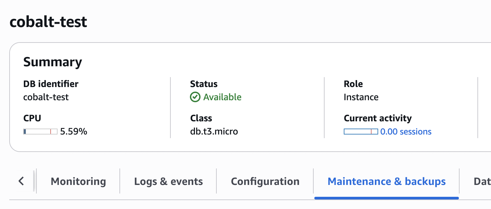
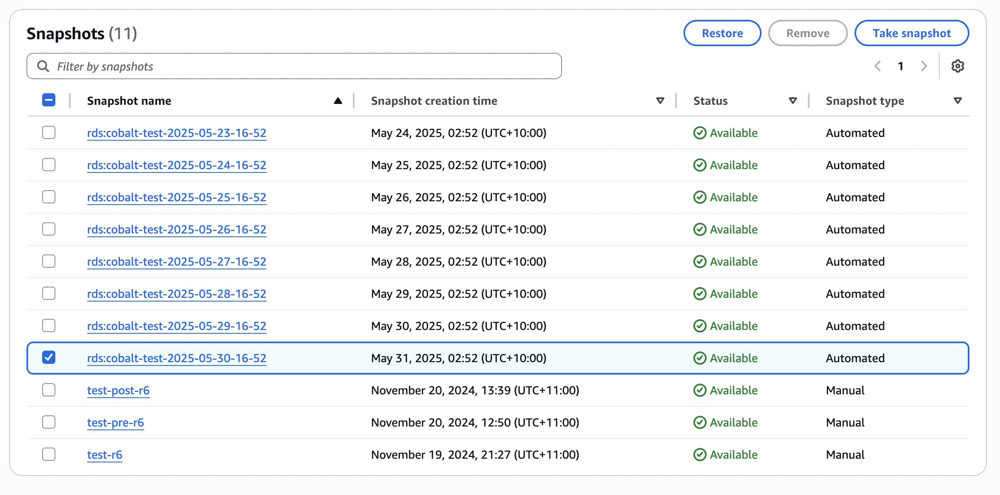
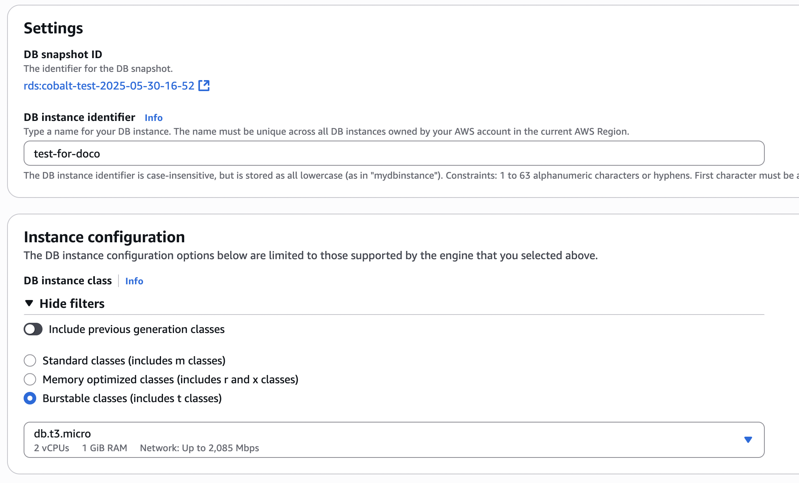
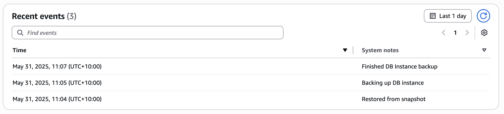
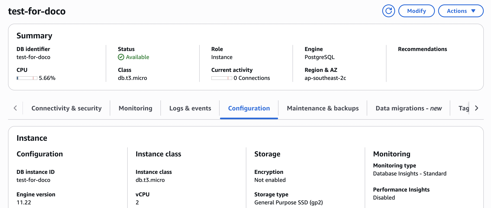
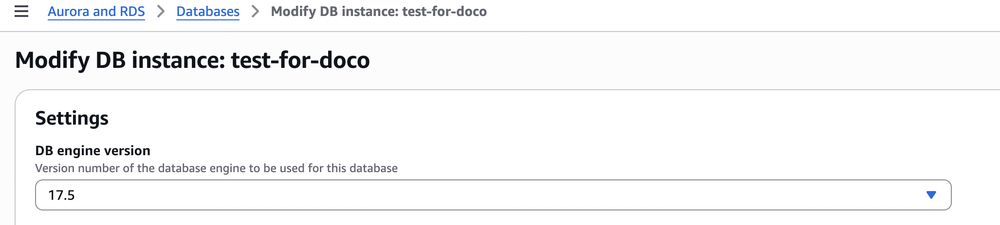
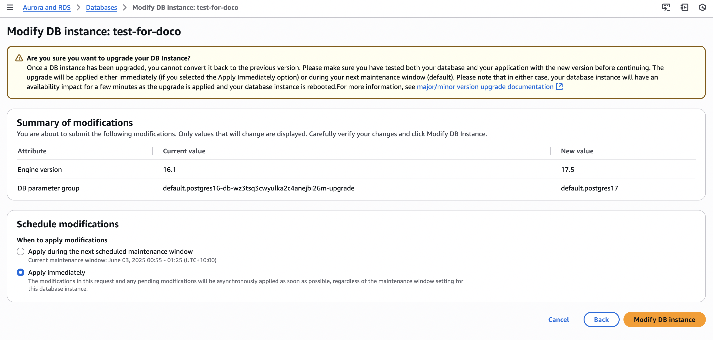
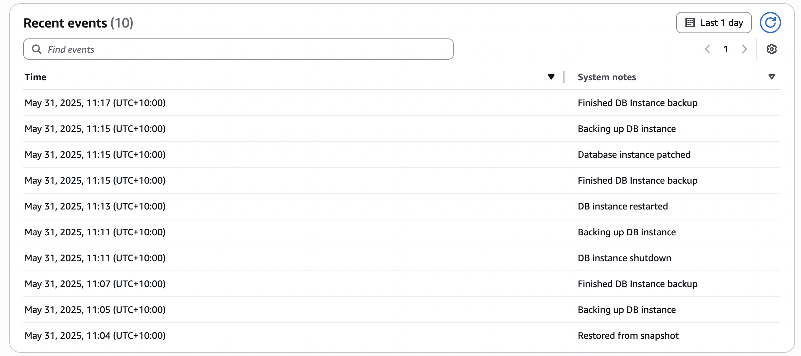

:orphan:

.. image:: ../../images/cobalt.jpg
 :width: 300
 :alt: Cobalt Chemical Symbol

==================================
How To Upgrade Postgres
==================================

As long as some downtime is acceptable, we can do database upgrades in a relatively
simple way.

Test
====

The Test database serves Test and UAT. Obviously do this one first.

You can do this from the CLI, but as it isn't that common an activity, we'll show the AWS Console
method here.

Create New Database Server from Snapshot
-----------------------------------------

Go to RDS, select your database, and go to the **Maintenance and Backups** tab.

Find your snapshot and click **Restore**.

In **Settings**, give it a name and choose your EC2 instance size.

You should be able to keep everything else at the default and click **Restore DB Instance**
at the bottom of the screen.

For small databases it doesn't take long to restore. It will then take a backup and if your
database version is a long way behind it will automatically upgrade it.

You can go into the database and go to the **Logs and events** tab to see what has happened.

Upgrade Database Server
-----------------------

Wait for the database server to be restored and ready.

If you go to the **Configuration** tab you will see the version of your database server.

You can click **Modify** to upgrade the database.

Select the version you would like.

You can leave everything else as it is and scroll to the bottom to click **Continue**.

You will be taken to a confirmation screen. Select **Apply immediately** and then
click **Modify DB instance**.

*In this case the version was so old that it was automatically upgraded to a supported version
after the restore.*

You can see the whole timeline if you go back to **Logs and events**:

Production
==========

Production is very similar to Test but with time pressures. It is necessary to stop any updates
while the database is upgraded.

.. note::

    There are ways to upgrade with zero downtime but they add complexity and risk. A more experienced
    RDS expert than the current author may wish to update this documentation.

Practice
--------

You can practice the upgrade by doing all of the steps apart from maintenance mode and the cut over.

This is a good idea to do, not just to check that it works, but to get an estimate of how long the
outage window will need to be.

Maintenance Mode
----------------

Start by putting the system into maintenance mode.

..note::

    There is currently a bug (June 2025) that means you need to do this through the Elastic Beanstalk settings
    not the MyABF system option, if there are more than one Elastic Beanstalk systems set up. e.g.
    **cobalt-production-green** and **cobalt-production-blue**.

You can do this either by changing the environment variable `MAINTENANCE_MODE` to **ON** or by going into
MyABF to **Admin** and **System Settings**.

Create New Database Server from Snapshot
-----------------------------------------

Follow the same process as for Test above.

Upgrade Database Server
-----------------------

Follow the same process as for Test above.

Change Elastic Beanstalk Environment Variables
----------------------------------------------

Update the Production Elastic Beanstalk environment to change the environment variable
`RDS_HOSTNAME` to be the name of the new server. You can do this from the UI.

Quick Checks
------------

Use an admin account to login to Production MyABF and check it looks okay.x`

Remove Maintenance Mode
-----------------------

..note::

    There is currently a bug (June 2025) that means you need to do this through the Elastic Beanstalk settings
    not the MyABF system option, if there are more than one Elastic Beanstalk systems set up. e.g.
    **cobalt-production-green** and **cobalt-production-blue**.

You can do this either by changing the environment variable `MAINTENANCE_MODE` to **OFF** or by going into
MyABF to **Admin** and **System Settings**.
