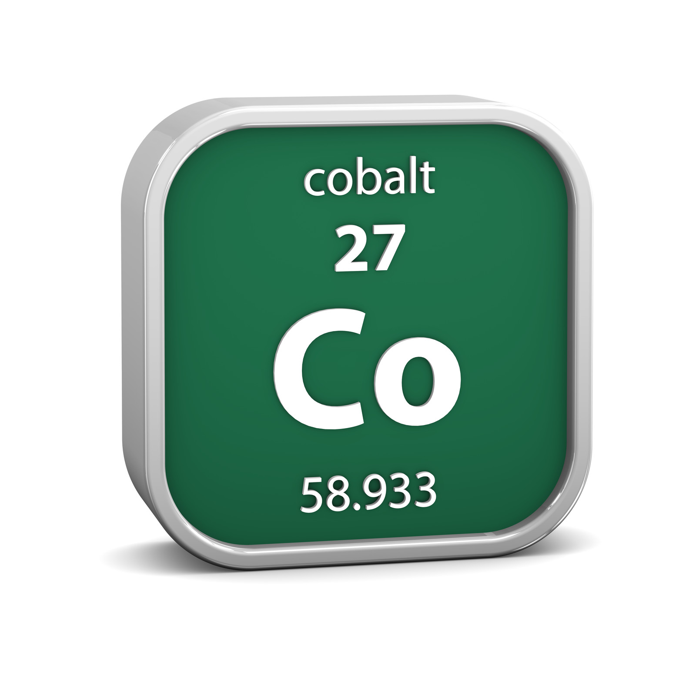

:orphan:

========================================
Using the Xero Integration
========================================

Overview
--------

The ``xero`` app integrates Cobalt with `Xero <https://www.xero.com>`_ accounting software.
It is used by the ABF to issue invoices to clubs/organisations and record payments against them.

All Xero API calls are wrapped by a single class — ``XeroApi`` in ``xero/core.py``.
Credentials (access token, tenant ID) are stored in the database in the ``XeroCredentials``
singleton model. A local mirror of issued invoices is kept in ``XeroInvoice``.

----

Architecture
------------

Cobalt uses Xero's **Custom Connection** — a machine-to-machine OAuth 2.0
**client credentials** flow. There is no user-facing consent screen or redirect
URI. The token lifecycle is:

1. Cobalt holds a ``XERO_CLIENT_ID`` and ``XERO_CLIENT_SECRET`` in its
   environment configuration (see :doc:`setting_up_xero`).
2. Before every API call, ``refresh_xero_tokens()`` checks whether the stored
   access token is still valid. If it has expired, it POSTs directly to
   ``https://identity.xero.com/connect/token`` with the client credentials to
   obtain a fresh access token.
3. The new token (valid for ~30 minutes) is saved to ``XeroCredentials`` and
   used immediately. No refresh token is involved — a new access token is
   always obtained directly from the token endpoint.

.. code-block:: text

    Cobalt                                          Xero
    ------                                          ----
      |-- POST /connect/token (client_credentials) -->|
      |<-- access_token (30 min TTL) -----------------|
      |-- save to XeroCredentials -------------------|

      ... (30 min later, token expires) ...

      |-- POST /connect/token (client_credentials) -->|
      |<-- new access_token --------------------------|
      |-- save to XeroCredentials -------------------|

The **Connect** button on the ``/xero/`` admin page forces an immediate token
fetch and also resolves the tenant UUID via ``set_tenant_id()``. This only
needs to be done once per environment (or after credentials change).

----

Configuration
-------------

These environment variables must be set (via Elastic Beanstalk config or a local ``.env``):

.. list-table::
   :header-rows: 1
   :widths: 30 70

   * - Variable
     - Description
   * - ``XERO_CLIENT_ID``
     - Client ID from the Xero Custom Connection app
   * - ``XERO_CLIENT_SECRET``
     - Client secret from the Xero Custom Connection app
   * - ``XERO_BANK_ACCOUNT_CODE``
     - Default Xero account code used when recording payments (e.g. ``"090"``)
   * - ``XERO_SETTLEMENT_ACCOUNT_CODE``
     - Xero account code for club settlement payables

----

Models
------

XeroCredentials
~~~~~~~~~~~~~~~

A singleton (at most one row). Stores the access token and tenant ID.
Do not access this directly — ``XeroApi.__init__`` loads it automatically.

.. list-table::
   :header-rows: 1
   :widths: 25 75

   * - Field
     - Purpose
   * - ``access_token``
     - Short-lived bearer token (up to 2 000 chars)
   * - ``expires``
     - DateTimeField; when the access token expires (~30 minutes after issue)
   * - ``tenant_id``
     - UUID of the connected Xero organisation

.. note::
   The ``refresh_token`` and ``authorisation_code`` fields exist on the model
   from an earlier OAuth authorization-code implementation and are no longer
   used. They are kept to avoid a breaking migration.

XeroInvoice
~~~~~~~~~~~

A local mirror of every invoice issued through Cobalt. Created by ``create_invoice()``
and updated in-place by ``void_invoice()`` and ``create_payment()``.

.. list-table::
   :header-rows: 1
   :widths: 25 75

   * - Field
     - Notes
   * - ``organisation``
     - FK to ``organisations.Organisation``
   * - ``xero_invoice_id``
     - Xero UUID (unique)
   * - ``invoice_number``
     - Human-readable number assigned by Xero (e.g. ``INV-0042``)
   * - ``invoice_type``
     - ``ACCREC`` (accounts receivable) or ``ACCPAY`` (accounts payable)
   * - ``amount``
     - Total invoice amount
   * - ``status``
     - ``DRAFT`` / ``AUTHORISED`` / ``PAID`` / ``VOIDED``
   * - ``reference``
     - Free-text reference string
   * - ``date``
     - Invoice date
   * - ``due_date``
     - Payment due date

----

XeroApi Reference
-----------------

Import and instantiate once per request or job::

    from xero.core import XeroApi
    xero = XeroApi()

The constructor loads credentials from the database. Instantiation is cheap;
there is no connection overhead.

Authentication helpers
~~~~~~~~~~~~~~~~~~~~~~

These are called automatically by the API methods below. You should only need
them when setting up the integration for the first time or debugging auth issues.

``refresh_xero_tokens()``
    Checks whether the stored access token is still valid. If it has expired,
    POSTs to ``https://identity.xero.com/connect/token`` with the client
    credentials (Basic auth, ``grant_type=client_credentials``) to obtain a
    fresh token, saves it, and updates ``self.access_token``.
    Returns the Xero token response dict, or ``{"message": "..."}`` if the
    token was already valid.

``set_tenant_id()``
    Resolves the tenant ID for the Custom Connection. Decodes the JWT access
    token to extract the ``authentication_event_id``, then calls
    ``GET https://api.xero.com/connections`` (with ``Xero-User-Id`` set to that
    value) to find the matching tenant and saves its UUID to ``XeroCredentials``.
    Called once after the initial connect.

Contact methods
~~~~~~~~~~~~~~~

Xero represents each billing customer as a **Contact**. An ``Organisation`` must
have a ``xero_contact_id`` before you can create invoices against it.

``create_organisation_contact(organisation) -> str | None``
    Creates a new Xero contact from the Organisation's fields (name, email,
    address). Saves the returned ``ContactID`` back to ``organisation.xero_contact_id``
    and returns it. Returns ``None`` on failure.

    ::

        contact_id = xero.create_organisation_contact(org)
        # org.xero_contact_id is now set

``update_organisation_contact(organisation) -> bool``
    Pushes updated Organisation data (name, email, address) to an existing Xero
    contact. Requires ``organisation.xero_contact_id`` to be set. Returns ``True``
    on success, ``False`` on failure.

``archive_organisation_contact(organisation) -> bool``
    Sets the Xero contact status to ``ARCHIVED`` and clears
    ``organisation.xero_contact_id``. Use this instead of deleting — Xero
    prevents deletion of contacts with transaction history. Returns ``True`` on
    success, ``False`` on failure.

Invoice methods
~~~~~~~~~~~~~~~

``create_invoice(organisation, line_items, reference, invoice_type="ACCREC", due_days=15) -> XeroInvoice | None``
    Creates an invoice in Xero and saves a local ``XeroInvoice`` record.

    **Parameters:**

    .. list-table::
       :header-rows: 1
       :widths: 25 75

       * - Parameter
         - Description
       * - ``organisation``
         - The Organisation to invoice. Must have ``xero_contact_id`` set.
       * - ``line_items``
         - List of dicts. Each must have ``description``, ``quantity``,
           ``unit_amount``, ``account_code``. Optional: ``tax_type``
           (defaults to ``"NONE"``).
       * - ``reference``
         - Free-text reference string, e.g. ``"ABF-JUNE-2026"``.
       * - ``invoice_type``
         - ``"ACCREC"`` (send to a customer) or ``"ACCPAY"`` (receive from a
           supplier).
       * - ``due_days``
         - Days until due. Due date is set to ``today + due_days``.

    Returns the ``XeroInvoice`` instance on success, ``None`` on failure.

    ::

        invoice = xero.create_invoice(
            organisation=org,
            line_items=[
                {
                    "description": "ABF Settlement June",
                    "quantity": 1,
                    "unit_amount": 344.55,
                    "account_code": "200",
                }
            ],
            reference="ABF-JUNE-2026",
            invoice_type="ACCREC",
            due_days=30,
        )

``get_invoice(xero_invoice_id) -> dict``
    Fetches raw invoice data from Xero. Returns the Xero API response dict.

    ::

        data = xero.get_invoice(invoice.xero_invoice_id)

``void_invoice(xero_invoice_id) -> bool``
    Voids an invoice in Xero and updates the local ``XeroInvoice.status`` to
    ``"VOIDED"``. Returns ``True`` on success, ``False`` on failure.

    ::

        xero.void_invoice(invoice.xero_invoice_id)

Payment methods
~~~~~~~~~~~~~~~

``create_payment(xero_invoice_id, amount, payment_date=None, account_code=None) -> dict``
    Records a payment against an invoice in Xero. Updates the local
    ``XeroInvoice.status`` to ``"PAID"`` when Xero confirms the payment.

    .. list-table::
       :header-rows: 1
       :widths: 25 75

       * - Parameter
         - Description
       * - ``xero_invoice_id``
         - The Xero invoice UUID (not the local Django PK).
       * - ``amount``
         - Payment amount as a float.
       * - ``payment_date``
         - ``datetime.date`` of payment. Defaults to today.
       * - ``account_code``
         - Xero bank account code. Defaults to ``XERO_BANK_ACCOUNT_CODE``
           from settings.

    Returns the raw Xero API response dict.

    ::

        xero.create_payment(invoice.xero_invoice_id, amount=344.55)

Listing methods
~~~~~~~~~~~~~~~

``get_invoices_for_organisation(organisation, date_from=None, date_to=None) -> list``
    Returns a list of raw Xero invoice dicts for the given Organisation.
    Optional ``date_from`` / ``date_to`` (``datetime.date``) filter by invoice date.
    Returns ``[]`` if the organisation has no ``xero_contact_id``.

    ::

        from datetime import date
        invoices = xero.get_invoices_for_organisation(
            org,
            date_from=date(2026, 1, 1),
            date_to=date(2026, 6, 30),
        )

``get_payments_for_organisation(organisation, date_from=None, date_to=None) -> list``
    Returns a flat list of payment dicts for all paid invoices belonging to the
    Organisation. Each dict is a Xero Payment object augmented with
    ``InvoiceID``, ``InvoiceNumber``, and ``InvoiceReference`` from the parent
    invoice. Filtered by invoice date when ``date_from`` / ``date_to`` are given.

    ::

        payments = xero.get_payments_for_organisation(org)
        for p in payments:
            print(p["InvoiceReference"], p["Amount"])

Low-level helpers
~~~~~~~~~~~~~~~~~

These underlie all the methods above. Use them if you need to call a Xero
endpoint that has no dedicated wrapper yet:

``xero_api_get(url) -> dict``
    Performs a GET request (refreshing the token first) and returns the JSON
    response as a dict.

``xero_api_post(url, json_data) -> dict``
    Performs a POST request and returns the JSON response.

``xero_api_put(url, json_data) -> dict``
    Performs a PUT request and returns the JSON response.

----

Common workflows
----------------

Onboarding a new organisation
~~~~~~~~~~~~~~~~~~~~~~~~~~~~~~

::

    from xero.core import XeroApi
    from organisations.models import Organisation

    xero = XeroApi()
    org = Organisation.objects.get(org_id="1234")

    # Step 1: create the contact in Xero
    contact_id = xero.create_organisation_contact(org)
    if not contact_id:
        # handle error — check logs
        ...

Monthly settlement invoice
~~~~~~~~~~~~~~~~~~~~~~~~~~

::

    invoice = xero.create_invoice(
        organisation=org,
        line_items=[
            {
                "description": "Table fees — June 2026",
                "quantity": 120,
                "unit_amount": 1.50,
                "account_code": "200",
            },
            {
                "description": "Annual affiliation fee",
                "quantity": 1,
                "unit_amount": 85.00,
                "account_code": "201",
            },
        ],
        reference="ABF-2026-06",
        invoice_type="ACCREC",
        due_days=14,
    )

    if invoice:
        print(f"Invoice {invoice.invoice_number} created — total ${invoice.amount}")

Recording a payment
~~~~~~~~~~~~~~~~~~~

::

    from datetime import date

    xero.create_payment(
        invoice.xero_invoice_id,
        amount=float(invoice.amount),
        payment_date=date(2026, 7, 1),
    )

Cancelling an invoice
~~~~~~~~~~~~~~~~~~~~~

::

    success = xero.void_invoice(invoice.xero_invoice_id)

----

Admin UI
--------

A minimal admin interface is available at ``/xero/`` (restricted to ABF staff):

* **Home** (``/xero/``) — shows current configuration and token status.
* **Connect** (``/xero/connect``) — HTMX action on the home page; forces an
  immediate token fetch via client credentials and resolves the tenant ID.
  Only needed once per environment, or after credentials change.
* **Refresh keys** — HTMX action on the home page; forces an immediate token
  refresh without re-resolving the tenant ID.
* **API playground** — HTMX form to run ``list_contacts``, ``create_contact``,
  ``update_contact``, and ``archive_contact`` directly from the browser.

----

Testing
-------

Unit tests live in ``xero/tests/unit/unit_test_xero_api.py``. They cover all
``XeroApi`` methods with 25 test cases.

Running the tests
~~~~~~~~~~~~~~~~~

::

    python manage.py run_tests_unit --app xero

By default all Xero HTTP calls are **mocked** — no credentials or network access
are required.

Mock / live toggle
~~~~~~~~~~~~~~~~~~

Two flags at the top of the test file control behaviour:

.. list-table::
   :header-rows: 1
   :widths: 30 70

   * - Flag
     - Default
   * - ``MOCK_XERO_API``
     - ``True`` — patch all HTTP calls; runs offline
   * - ``LIVE_XERO_CONTACT_ID``
     - ``""`` — UUID of a contact in your Xero demo company (needed for live invoice/payment tests)

To run against a real Xero sandbox:

1. Ensure valid client credentials are set (``XERO_CLIENT_ID`` / ``XERO_CLIENT_SECRET``).
3. Click **Connect** on the ``/xero/`` admin page to fetch a token and store the tenant ID.
4. In Xero, create a contact and copy its UUID.
5. Set ``MOCK_XERO_API = False`` and ``LIVE_XERO_CONTACT_ID = "<uuid>"`` in the
   test file.
6. Run the unit tests.

.. warning::
   **Live API tests create persistent data in Xero** — Django's transaction
   rollback does not undo HTTP calls. Always use a demo/sandbox company.
   Never run live tests against the production Xero organisation.

Writing tests for new Xero-integrated code
~~~~~~~~~~~~~~~~~~~~~~~~~~~~~~~~~~~~~~~~~~

Mock at the method level, not the ``requests`` level::

    from unittest.mock import patch
    from xero.core import XeroApi
    from xero.models import XeroCredentials

    def test_something(self):
        XeroCredentials.objects.get_or_create()
        xero = XeroApi()

        mock_response = {"Invoices": [{"InvoiceID": "abc", "InvoiceNumber": "INV-001", "Status": "AUTHORISED"}]}
        with patch.object(xero, "xero_api_post", return_value=mock_response) as mock_post:
            invoice = xero.create_invoice(
                organisation=self.org,
                line_items=[{"description": "Test", "quantity": 1, "unit_amount": 10.00, "account_code": "200"}],
                reference="TEST-001",
            )

        # Inspect what was sent to Xero
        payload = mock_post.call_args[0][1]
        self.manager.save_results(
            status=invoice is not None and payload["Invoices"][0]["Reference"] == "TEST-001",
            test_name="My new test",
            test_description="Verify ...",
            output=f"invoice={invoice!r}",
        )

See ``xero/tests/unit/unit_test_xero_api.py`` for the canonical reference
implementation, including the ``_patch_post`` / ``_patch_get`` / ``_skip_in_live_mode``
helper pattern.
