:orphan:

.. image:: ../../images/cobalt.jpg
 :width: 300
 :alt: Cobalt Chemical Symbol

============================================================
Setting Up Xero for Production — Administrator Guide
============================================================

This guide is written for ABF finance and administration staff. It walks
through everything you need to do in Xero and in Cobalt to get the integration
working in production. You do not need to be a developer to follow these steps,
but you will need to pass some information to your technical team along the way
(Steps 5 and 8).

For the developer and technical reference (environment variables, code examples,
API details) see :doc:`setting_up_xero`.

----

Before You Start
----------------

You will need:

* A **Xero account** with administrator access to the ABF's production Xero
  organisation. If you are not already an administrator, ask your Xero
  administrator to invite you.
* The Cobalt production system already deployed and running (ask your technical
  team to confirm this before you begin).
* A way to contact your technical team — you will need to pass them a few
  credentials part-way through (Steps 5 and 8).

.. note::
   Do **not** follow this guide against the Xero Demo Company or a test Cobalt
   environment. The steps below are for production only. If you need to test
   first, ask your technical team to set up a separate test connection using the
   Xero Demo Company.

----

Step 1 — Create a Xero App
---------------------------

Cobalt connects to Xero using a special type of integration called a **Custom
Connection**. This is like giving Cobalt a secure key to access your Xero
account automatically, without anyone needing to log in each time.

You create this connection in the Xero Developer Portal — a free part of the
Xero website that any Xero account holder can access.

1. Go to `https://developer.xero.com/app/manage
   <https://developer.xero.com/app/manage>`_ and sign in with your Xero
   account.

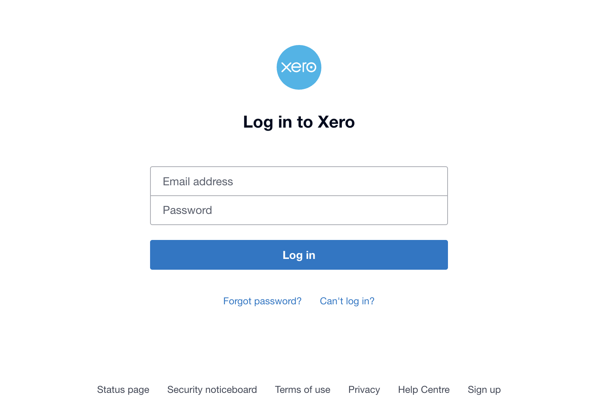

2. You will see the **My Apps** page. Click the **New app** button in the
   top-right corner.

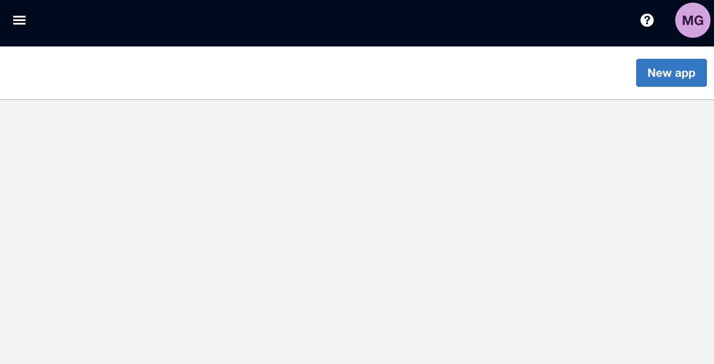

3. Fill in the **New app** form:

   .. list-table::
      :header-rows: 1
      :widths: 35 65

      * - Field
        - What to enter
      * - App name
        - ``MyABF`` (or any clear name)
      * - Integration type
        - Select **Custom Connection**
      * - Company or application URL
        - ``https://www.myabf.com.au``

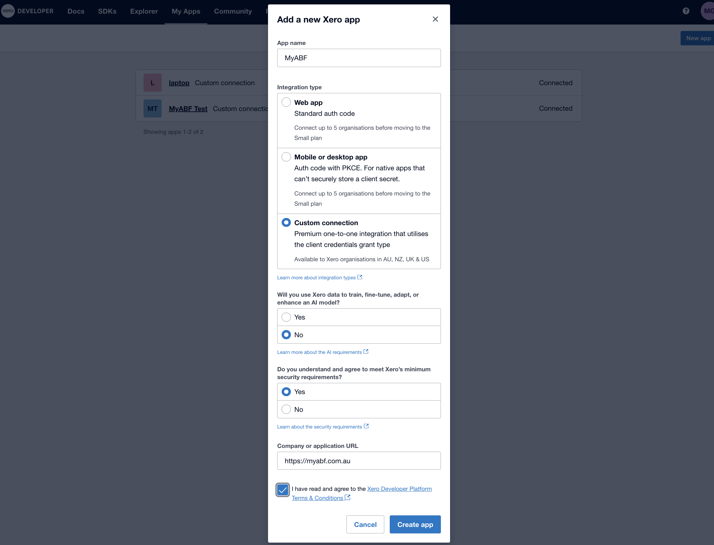

4. Click **Create app**.

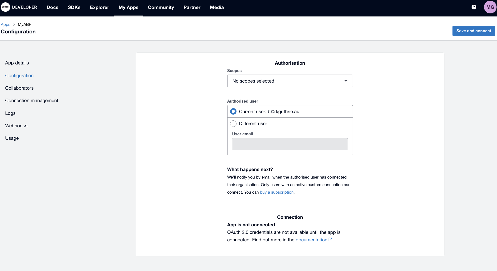

5. Select scopes.

    You need to select **accounts.transactions**, **accounts.settings** and **accounts.contacts**.

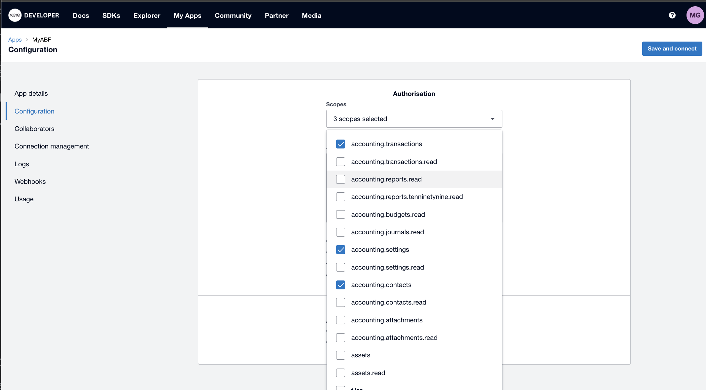

5. Create app

Click on **Save and Connect** to create the connection.

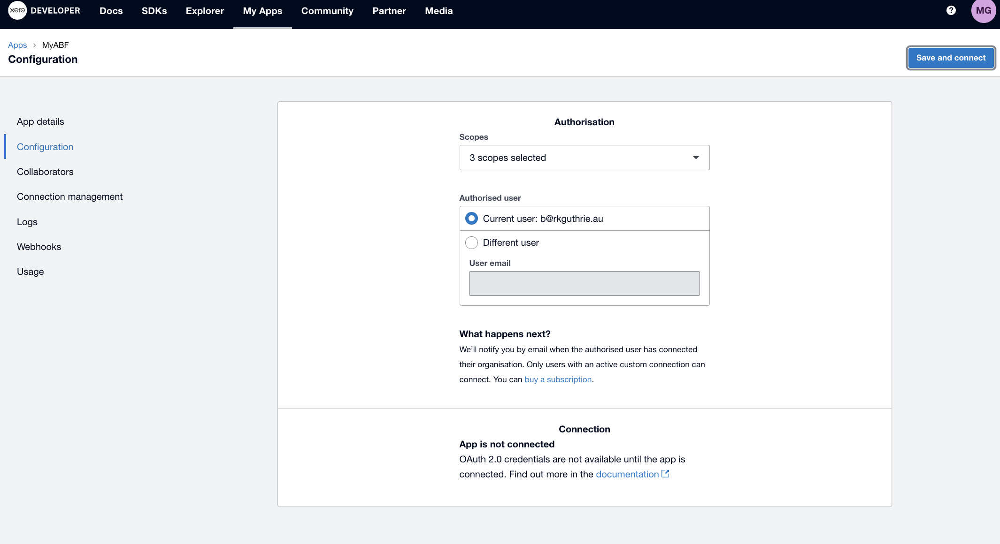

6. Click on Email

You will receive an email with a link. Click on this to go back into Xero and
approve the connection. You need to connect it to the production system and not
the Demo Company.

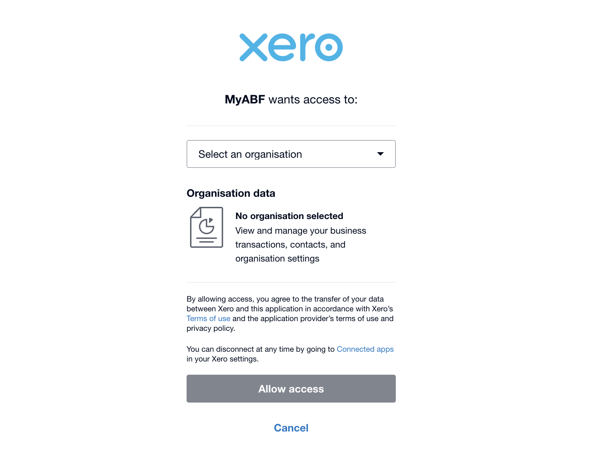

----

Step 2 — Copy Your Credentials
--------------------------------

Cobalt needs a Client ID and a Client Secret to authenticate with Xero. These
are like a username and password for the integration — keep them secure and do
not share them publicly.

1. On the **Configuration** tab, scroll to the **Credentials** section.
2. Copy the **Client ID** — paste it into a secure document or password manager.
3. Click **Copy secret** to copy the **Client Secret** — paste it alongside the
   Client ID. The secret is only shown once, so make sure you save it now.

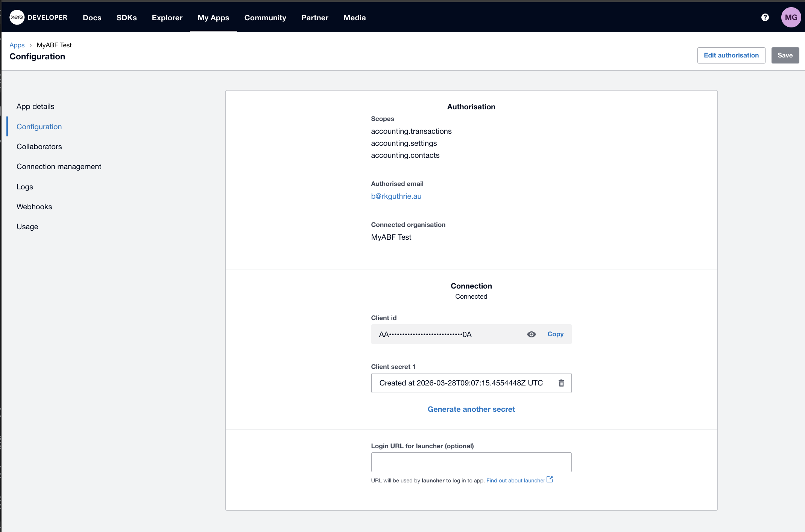

.. warning::
   If you lose the Client Secret, you can regenerate it in the Xero Developer
   Portal — but you will need to give the new secret to your technical team to
   update the Cobalt configuration again.

----

In addition to the Credentials, you also need to provide the exact name of the Xero company. Spaces and case sensitivity are important.

Step 3 — Set Up GL Accounts in Xero
-------------------------------------

Before Cobalt can create invoices, three special accounts must exist in your
Xero **Chart of Accounts**. These may already exist in your production Xero
organisation — check before creating new ones.

Go to **Accounting → Chart of Accounts** in Xero.

The three accounts Cobalt needs are:

.. list-table::
   :header-rows: 1
   :widths: 30 25 45

   * - What it is for
     - Account type in Xero
     - Notes
   * - **Payment clearing** — used when recording that a club has paid an
       invoice
     - **Bank**
     - This is usually the ABF's main business bank account or a dedicated
       clearing account. It must be a Bank-type account so it appears under
       **Banking** in Xero.
   * - **Settlement payables** — used when recording money owed to clubs for
       table money settlements
     - **Current Liability**
     - This represents money the ABF is holding on behalf of clubs until it
       is transferred. No GST applies.
   * - **Fee income** — used for the ABF processing fee charged to clubs
     - **Revenue** or **Other Income**
     - GST (10%) applies to this income. It must be a revenue-type account.

The values we have at the moment are::

     XERO_BANK_ACCOUNT_CODE = 3113
     XERO_FEE_ACCOUNT_CODE = 0130
     XERO_FEE_TAX_TYPE = OUTPUT
     XERO_PAYABLE_ACCOUNT_CODE = 3113
     XERO_PAYABLE_TAX_TYPE = BASEXCLUDED

For each account, note down the **Code** shown in the Code column — you will
need these codes in Step 5.

Step 4 - Branding Theme ID
---------------------------

The template used to send emails to the clubs needs to be provide too.

Within Xero, go to **Settings** and then under **Sales** go to **Invoice Settings**.

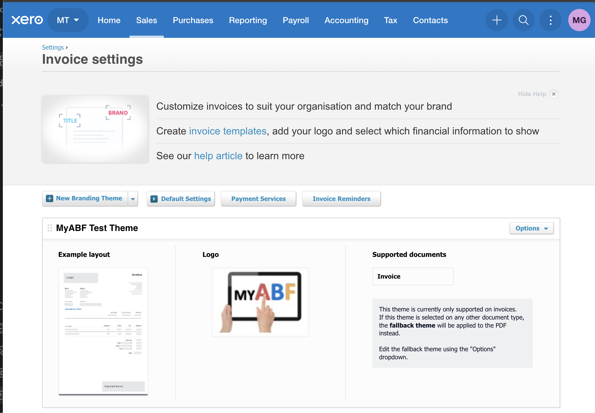

Find your theme and select **Options** then **Preview and Edit Invoice Theme**.

What we need from here is the last part of the URL in the browser address bar.

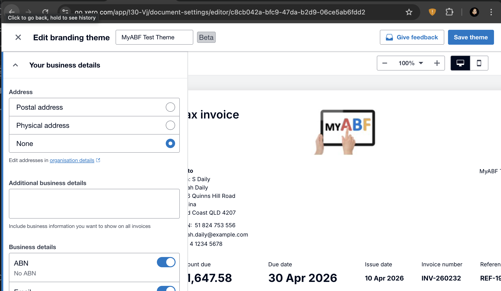

In this example the URL is: https://go.xero.com/app/!30-Vj/document-settings/editor/c8cb042a-bfc9-47da-b2d9-06ce5ab6fdd2

The part we need for the `XERO_BRANDING_THEME_ID` is `c8cb042a-bfc9-47da-b2d9-06ce5ab6fdd2`

----

Step 5 — Give Information to Your Technical Team
--------------------------------------------------

At this point, you have everything the technical team needs to configure the
Cobalt side of the integration. Send them the following five values securely
(for example, via a password manager's share feature or an encrypted message):

.. list-table::
   :header-rows: 1
   :widths: 40 60

   * - What to give them
     - Where you got it
   * - **Client ID** (XERO_CLIENT_ID)
     - Xero Developer Portal → your app → Configuration tab → Credentials
   * - **Client Secret** (XERO_CLIENT_SECRET)
     - Xero Developer Portal → your app → Configuration tab → Credentials
   * - **Bank/clearing account code** (XERO_BANK_ACCOUNT_CODE)
     - Xero → Chart of Accounts → Code column (Bank-type account)
   * - **Settlement payables account code** (XERO_PAYABLE_ACCOUNT_CODE)
     - Xero → Chart of Accounts → Code column (Current Liability account)
   * - **Fee income account code** (XERO_FEE_ACCOUNT_CODE)
     - Xero → Chart of Accounts → Code column (Revenue account)
   * - **Company Name** (XERO_TENANT_NAME)
     - Xero → Top of page
   * - **Branding Theme ID** (XERO_BRANDING_THEME_ID)
     - Xero → Settings → Invoice Settings → Edit (end of the URL)

Ask the technical team to deploy these values to the Cobalt production
environment and let you know when that is done. Then continue with Step 6.

----

Step 6 — Connect Cobalt to Xero
---------------------------------

Once the technical team has deployed the credentials, you can complete the
connection from inside Cobalt.

1. Log in to Cobalt at `https://www.myabf.com.au
   <https://www.myabf.com.au>`_ as an **ABF staff** user.

2. Navigate to `https://www.myabf.com.au/xero/
   <https://www.myabf.com.au/xero/>`_.

   You will see the Xero administration page. The **Configuration** panel at
   the top shows the current connection status.

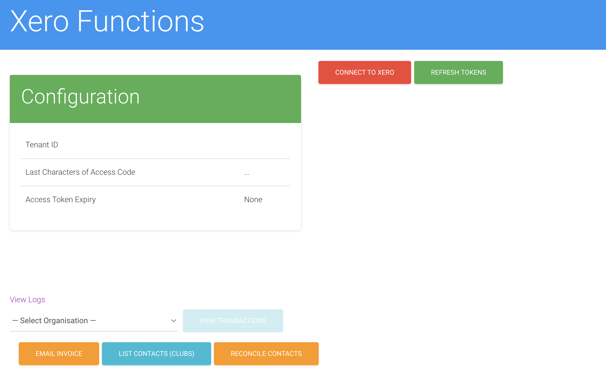

3. Click the **Connect** button. Cobalt will contact Xero, obtain an access
   token, and save the connection details.

4. When the page refreshes, check the **Configuration** panel. It should now
   show:

   * A **Tenant ID** — a long string of letters and numbers (this is Xero's
     internal identifier for your organisation).
   * An **Access token** — another long string (this is the secure key Cobalt
     is currently using to talk to Xero).
   * An **Expires** time — approximately 30 minutes from now.

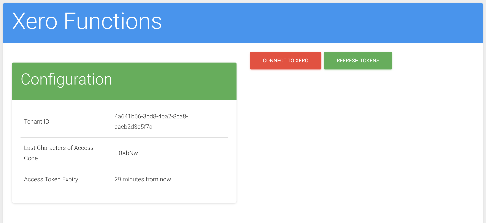

.. note::
   The access token expires every 30 minutes. Cobalt renews it automatically
   before every API call, so you will never need to click Connect again — unless
   the Client ID or Client Secret changes.

If the Configuration panel does not show a Tenant ID after clicking Connect,
check with your technical team that the credentials from Step 5 were deployed
correctly, then try again.

----

Step 7 — Add Clubs to Xero
----------------------------

Before Cobalt can create invoices for a club, that club must exist as a
**Contact** in Xero and be linked to the club's record in Cobalt.

You can do this one club at a time from the Xero administration page, or ask
your technical team to run a bulk sync. **This is needed even the clubs are already
set up in Xero as we still need to link them to MyABF**.

There is a script to create clubs in Xero (used for non-production systems) and a
script to link existing clubs in Xero to MyABF (used for production).

Bulk sync (all clubs at once)
~~~~~~~~~~~~~~~~~~~~~~~~~~~~~~

Ask your technical team to run the ``sync_xero_contact_ids`` management
command on the production server. This will link Xero Contacts from Xero into MyABF.

----

Step 8 — Set Up Webhooks
--------------------------

Webhooks allow Xero to notify Cobalt automatically whenever an invoice is
updated in Xero (for example, when it is marked as paid). This keeps the two
systems in sync without anyone needing to manually reconcile them.

Setting up the webhook in Xero
~~~~~~~~~~~~~~~~~~~~~~~~~~~~~~~

1. Go back to the `Xero Developer Portal
   <https://developer.xero.com/app/manage>`_ and open your app.

2. Click the **Webhooks** tab.

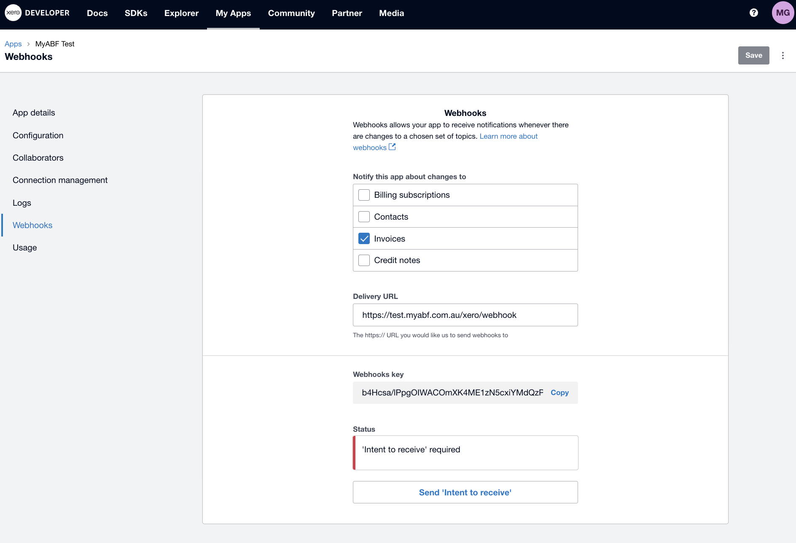

3. Click **Add Webhook** and fill in the form:

   .. list-table::
      :header-rows: 1
      :widths: 35 65

      * - Field
        - Value
      * - Webhook URL
        - ``https://www.myabf.com.au/xero/webhook``
      * - Event types
        - Tick **Invoices**

4. Click **Save**. Xero will immediately send a test request to Cobalt to
   verify the URL is reachable. If Cobalt is running correctly, this happens
   automatically and you will see the webhook listed as **active**.

5. On the Webhooks tab, copy the **Webhook key** — this is a signing secret
   that Cobalt uses to verify that incoming requests really came from Xero.

Giving the webhook key to your technical team
~~~~~~~~~~~~~~~~~~~~~~~~~~~~~~~~~~~~~~~~~~~~~~

Pass the **Webhook key** to your technical team (using a secure channel, as in
Step 5). Ask them to add it to the Cobalt production configuration. Once they
confirm it is in place, the webhook is fully active.

----

Step 9 — Verify Everything is Working
---------------------------------------

Use the **API playground** on the Xero administration page to confirm the
end-to-end connection is working.

1. Navigate to ``/xero/`` in Cobalt.
2. In the **API playground**, select **List contacts** from the dropdown.
3. Click **Run**.

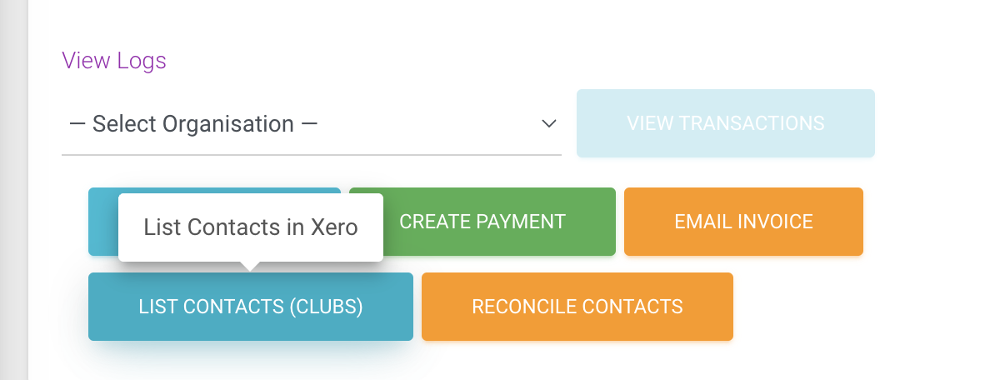

4. The response panel should show a list of contacts from your Xero
   organisation. If you completed Step 7, you should see the clubs you added.

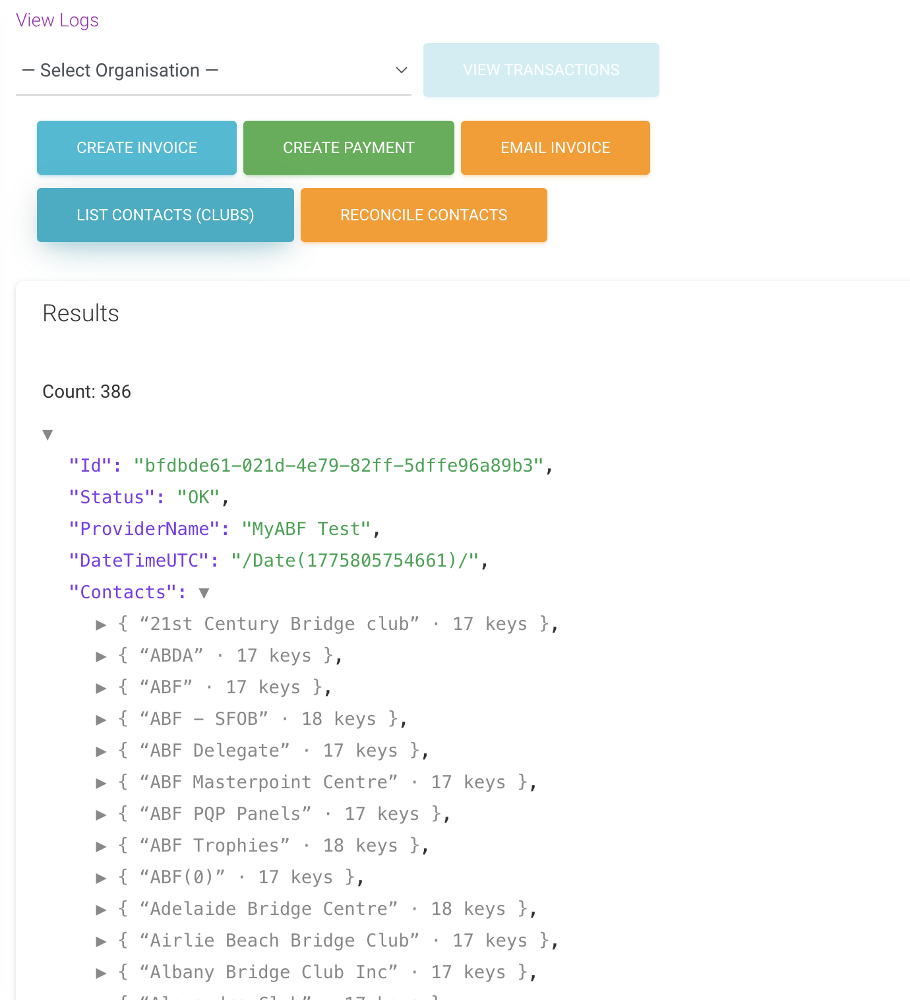

.. note::
   **Screenshot needed:** The API playground response panel showing a
   successful list of contacts returned from Xero.

If this works, the Xero integration is fully set up and ready for production
use.

----

Troubleshooting
---------------

.. list-table::
   :header-rows: 1
   :widths: 45 55

   * - What you see
     - What to do
   * - Clicking **Connect** does not populate the Tenant ID
     - Ask your technical team to confirm the Client ID and Client Secret from
       Step 5 were saved correctly in the Cobalt production configuration.
       After they confirm, click Connect again.
   * - The webhook is shown as inactive or the validation request failed
     - Check that Cobalt is running and publicly accessible at
       ``https://www.myabf.com.au/xero/webhook``. Ask your technical team to
       check the application logs for errors.
   * - A club does not appear when you list contacts, even after creating it
     - The contact may have been created in the wrong Xero organisation. Check
       that the Custom Connection app (Step 2) is linked to the production Xero
       organisation, not the Demo Company.
   * - An invoice shows an error about an account code
     - The account code entered in Chart of Accounts does not match what Cobalt
       is sending. Ask your technical team to confirm the account codes from
       Step 4 match those in the Cobalt configuration.
   * - You get a "401 Unauthorized" error in the API playground
     - The Client Secret may have expired or been regenerated in Xero. Return to
       the Xero Developer Portal, generate a new Client Secret, and give the new
       value to your technical team to update the configuration.
   * - Webhooks are not updating invoice statuses in Cobalt
     - Confirm with your technical team that the Webhook key from Step 8 was
       added to the Cobalt configuration. Also check the Xero Developer Portal
       to confirm the webhook status shows as **active**.

----

What Happens Next
-----------------

Once the integration is live, Cobalt and Xero will communicate automatically:

* When a club session settlement is processed in Cobalt, invoices are
  automatically created in Xero.
* When an invoice is marked as paid in Xero, Cobalt is notified via the webhook
  and updates its own records.
* A daily background task also checks for any missed updates as a safety net.

You can monitor the integration at any time by visiting ``/xero/`` in Cobalt
and checking the **Logs** page, which shows a history of every API call made
to Xero.

For detailed information about how the integration works under the hood, see
:doc:`setting_up_xero` (developer reference) and :doc:`using_xero` (API
reference).
