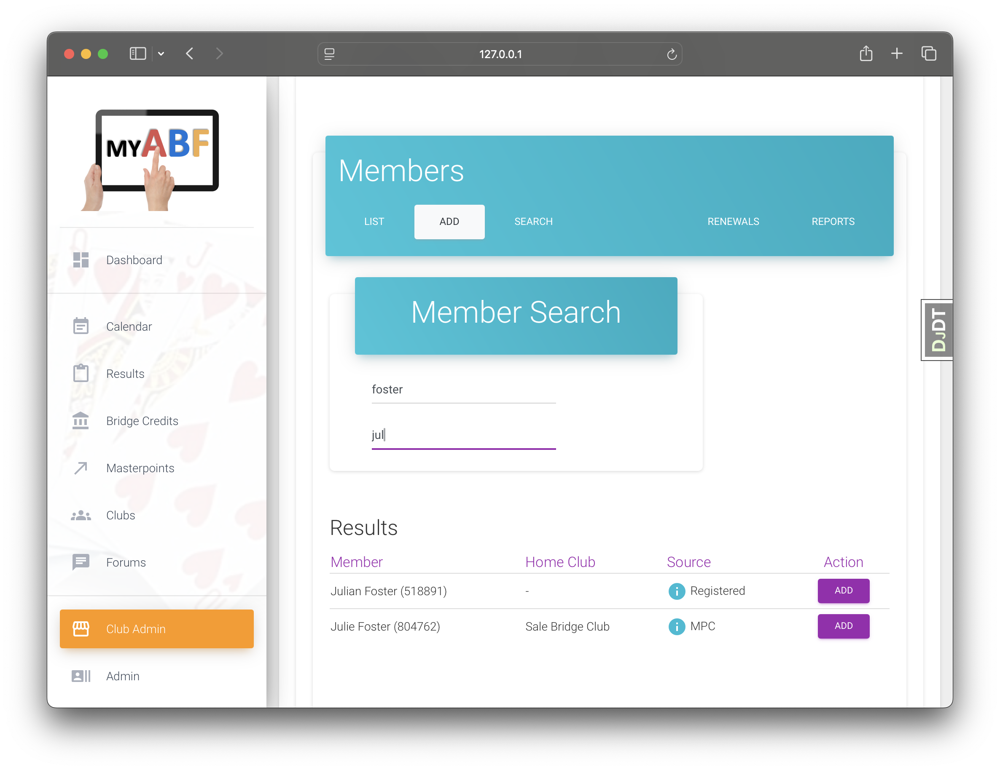
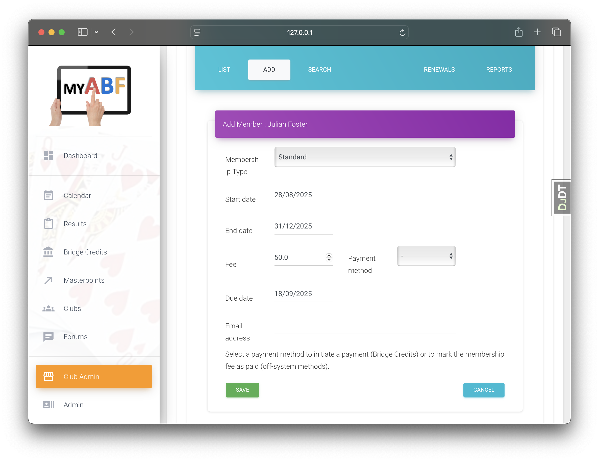
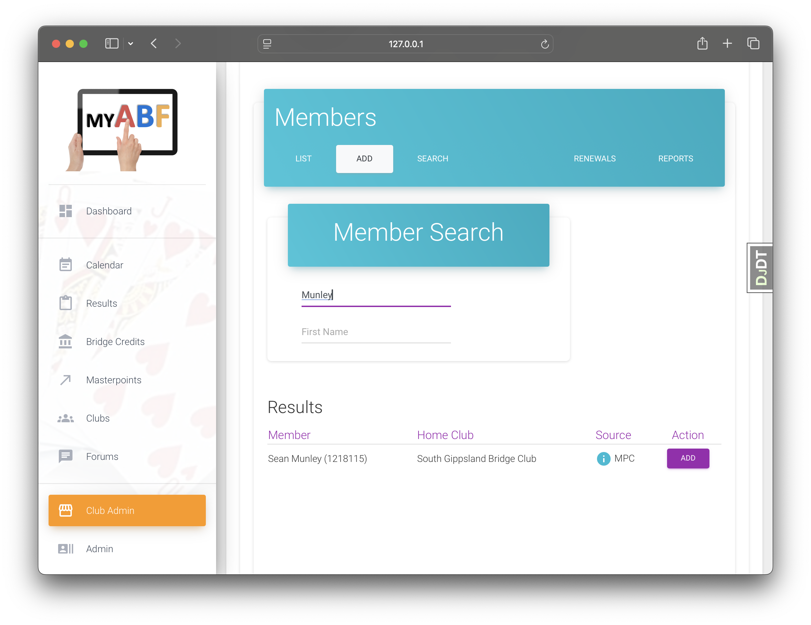
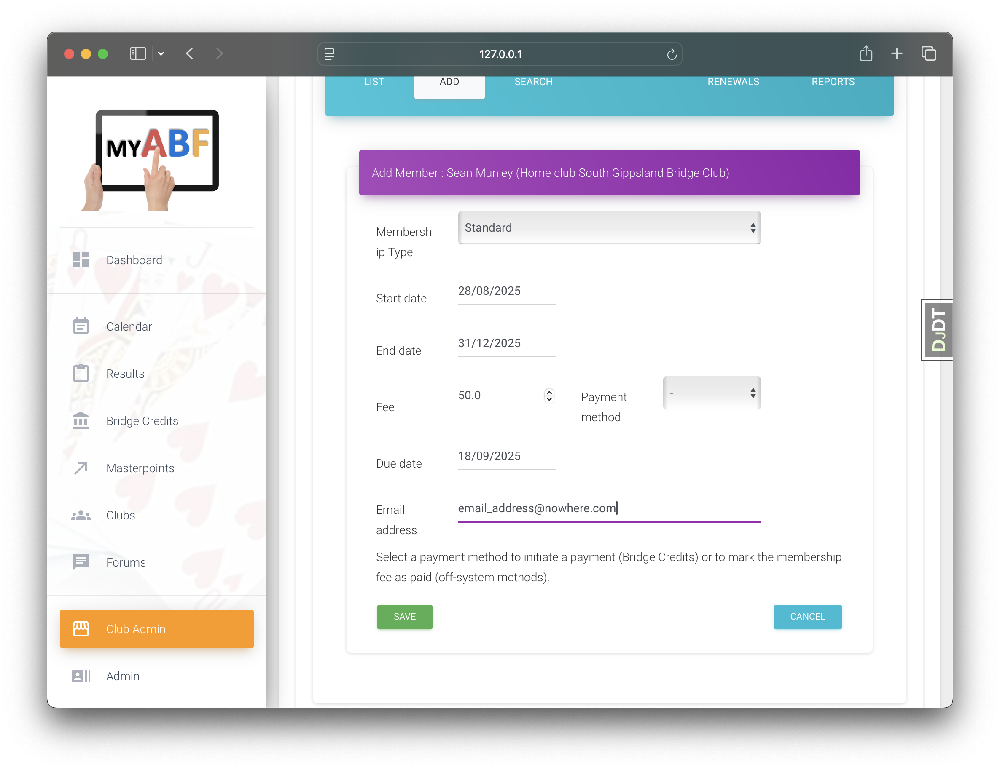
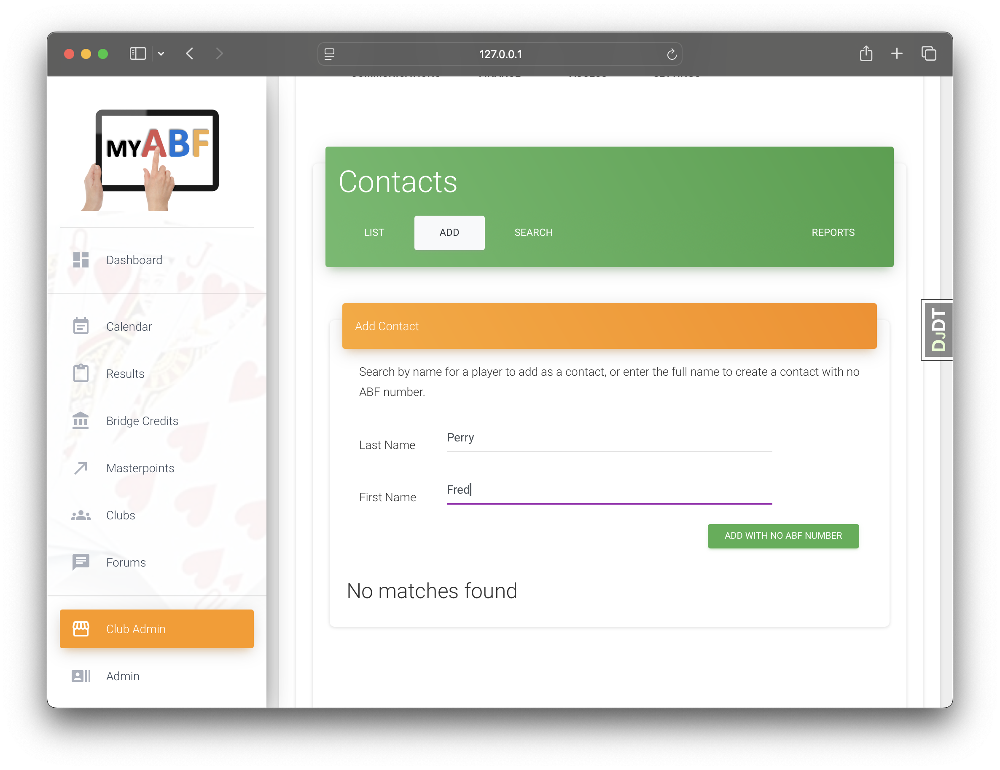

:orphan:

.. image:: ../../images/cobalt.jpg
 :width: 300
 :alt: Cobalt Chemical Symbol

:doc:`../how_to/using_references`

====================
Accounts Application
====================

.. note::
    This page has the documentation on how to use this application
    (externally provided APIs etc). If you are looking for
    information on how it works internally, you can find that in :doc:`./accounts_support`.

--------------
Module Purpose
--------------

Account handles things relating to User accounts such as profiles and settings.
There are multiple user types to support the need to deal with users who have not
registered for the system as well as real, registered users.

--------------
External Usage
--------------
*This section covers what you need to know to use this application from other parts of the system.*

``accounts.models.User`` is equivalent to ``request.user`` and is used throughout the
system for standard Django activities. ``accounts.models.User`` is a very widely used
foreign key.

We are in the process of moving some of the less commonly used attributes from
``accounts.models.User`` into ``accounts.models.UserAdditionalInfo`` so you may need
to load this for some fields.

.. _accounts_apis_label:

APIs
====

Get User Details
----------------
:func:`~accounts.accounts_views.core.get_user_or_unregistered_user_from_system_number`
    You can get a user (`User` or `UnregisteredUser`) from the system_number without needing to know the type of user.

.. code-block::

    from accounts.accounts_views.core import get_user_or_unregistered_user_from_system_number

    >>> alan = get_user_or_unregistered_user_from_system_number(100)
    >>> alan
    <User: Alan Admin (ABF: 100)>

    >>> anna = get_user_or_unregistered_user_from_system_number(65234)
    >>> anna
    <UnregisteredUser: Anna Albatross (ABF: 65234)>

Get Email Address
-----------------
:func:`~accounts.accounts_views.core.get_email_address_and_name_from_system_number`
    Get the best email address for a user. For an Unregistered user it will return the club specific email
    if one is set.

.. code-block::

    from accounts.accounts_views.core import get_email_address_and_name_from_system_number

    >>> get_email_address_and_name_from_system_number(100, my_club)
    ('a@b.com', 'Alan')

Reserved Users
==============

There are three special users within the system:

EVERYONE
    This is used mainly by RBAC for assigning security to all users.
TBA
    The *To Be Advised* user is a placeholder user mainly used by Events to hold a place in an entry until the actual player is identified.
ABF_USER
    This is the system user and is used when we want something to appear to have been done by the system rather than any individual.

If you wish to exclude (or include) system accounts, you can get a list of them from
``settings.ALL_SYSTEM_ACCOUNTS``.

-----------
User Types
-----------

We support three kinds of users:

* **Users** - These are full users of Cobalt and have signed up themselves.
* **UnregisteredUsers** - These are second class citizens used mainly by Organisations.
* **Contacts** - These are not ABF Members and are supported only for completeness for clubs.

-------------
User Objects
-------------

Accounts.models.User reflects a User who can login to the system and
perform bridge functions. Some users are reserved - we have an EVERYONE
user that is used by RBAC and a TBA user that is used by Events. With hindsight
we should have reserved a few other low numbered users however, the actual
numbers (primary keys) used doesn't really matter, it will just be another
environment variable for the test environments.

We allow users to share email addresses. The first user to register an
email address can login using this email or using their ABF System Number.
Subsequent users with the same email address can only login with their
ABF System Number.

Unregistered Users
==================

Accounts also supports a pseudo-user through the UnregisteredUser class.

This represents a user with a legitimate ABF System Number but someone
who has not yet registered themselves as a user of Cobalt. Typically
this is used when a club wants to set up their users but doesn't want
to have to ask all of them to register before it does. This is a placeholder
user which is replaced when the real user finally registers for the system.

To encourage users to register, only a basic set of things can be done
with Unregistered Users. They cannot receive results or enter events
for example.

This was put in place to allow clubs to import their member list and to
email their existing lists from within Cobalt with the minimal amount
of effort.

Emails sent to Unregistered Users have a link to allow them to register.

The key that identifies users is the ABF System Number.

* Users can only be full Users or Unregistered users, they cannot be both. The registration process ensures that when a user registers, all information is cut across from the Unregistered User which is then deleted.
* There can be only zero or one occurrences of an ABF System Number across Users and Unregistered Users.
* The Masterpoints Centre is the system of truth for mapping ABF System Numbers to first and last names, however users (the registered kind) may change this within Cobalt if they wish after registration.

Models that need to support both Users and Unregistered Users are required to do
this work themselves. They need to use system_id as the primary identifier and
handle Accounts informing them of users changing from Unregistered Users to
Users (this is done effectively with a callback in the registration view
of Accounts).

Contacts
========

Contacts may or may not have ABF numbers and even if they do they may or may not
have MyABF accounts.

If a club adds an existing User to their contacts then a MemberClubDetails record is
created. If they add an ABF member who is not signed up for MyABF then an UnregisteredUser
record will be created if it does not already exist, as well as the MemberClubDetails record.

For contacts who do not have an ABF number, an UnregisteredUser record is created with a fake
ABF number. The field `internal_system_number` on the UnregisteredUser is set to True.

Models
=============

**User**
    Standard Django user object, with system_number (ABF number). Used for people who have
    signed up for MyABF.

**UnregisteredUser**
    Mimics the User object (similar properties). Used for people who are ABF members but have
    not signed up. if they sign up, we delete the UnregisteredUser and replace with a User.

**Contact**
    Contacts are not explicitly defined. In order to find a contact you need to look for
    a MemberClubDetails that has a membership_status of contact.

**Organisation**
    Usually a club.

**MembershipType**
    Definition of a membership for an organisation. Fees, etc.

**MemberMembershipType**
    Links a "user" to a membership type.

    **NOTE: there is no foreign key relationship. The
    link is done as a soft link using system_number**.

**MemberClubDetails**
    Links an organisation (calls it a club) to a system_number (no foreign key) and a latest
    membership. Has a membership_status which can be "current", "lapsed" etc or "contact" to
    identify contacts who are not members at all.

**MemberClubOptions**
    Holds some preferences for a User/Organisation combination.

Relationships - Users and Organisations
=======================================

This section describes the model (database table) entries you should expect to find
for different types of user.

=========================================== ===========================  ========================
User Type                                   Required                     Optional
=========================================== ===========================  ========================
Registered User                             User                         UserAdditionalInfo
Registered User - with Club Memberships     User, MemberMembershipType,  UserAdditionalInfo
                                            MemberClubDetails
Unregistered User                           UnregisteredUser
Unregistered User - with Club Memberships   UnregisteredUser,
                                            MemberMembershipType,
                                            MemberClubDetails
Contact - User                              User,
                                            MemberClubDetails
Contact - UnregisteredUser                  UnregisteredUser,
                                            MemberClubDetails
Contact - No ABF Number                     UnregisteredUser,
                                            MemberClubDetails
=========================================== ===========================  ========================

Note: Players can be members/contacts of multiple clubs.

Membership Examples
====================

User
----

Using Fantasy Bridge Club, we add a User as a member.

The user already existed and no change is made to that object.

========================= ==================================
Database Row              User
========================= ==================================
system_number             518891 (Julian Foster)
========================= ==================================

We now have a MemberMembershipType record:

========================= ==================================
Database Row              MemberMembershipType
========================= ==================================
system_number             518891 (Julian Foster)
membership_type           Fantasy Bridge Club - Standard
========================= ==================================

And a MemberClubDetails record:

========================= ==================================
Database Row              MemberClubDetails
========================= ==================================
system_number             518891 (Julian Foster)
latest_membership         Fantasy Bridge Club - Standard
email
membership_status         Due
========================= ==================================

If the club sets an email address here, it will be used instead of
the email on the User record.

Unregistered User
-----------------

Using Fantasy Bridge Club, we add a member who is not signed up for
MyABF but is an ABF member.

A new UnregisteredUser object is created.

========================= ==================================
Database Row              UnregisteredUser
========================= ==================================
system_number             1218115 (Sean Munley)
internal_system_number    False
========================= ==================================

We now have a MemberMembershipType record:

========================= ==================================
Database Row              MemberMembershipType
========================= ==================================
system_number             1218115 (Sean Munley)
membership_type           Fantasy Bridge Club - Standard
========================= ==================================

And a MemberClubDetails record:

========================= ==================================
Database Row              MemberClubDetails
========================= ==================================
system_number             1218115 (Sean Munley)
latest_membership         Fantasy Bridge Club - Standard
email                     email_address@nowhere.com
membership_status         Due
========================= ==================================

Contact
-----------------

Using Fantasy Bridge Club, we add a contact who is not an ABF member.

A new UnregisteredUser object is created.

========================= ==================================
Database Row              UnregisteredUser
========================= ==================================
system_number             1000000004
internal_system_number    True
========================= ==================================

We don't get a MemberMembershipType record, but we do
get a MemberClubDetails record:

========================= ==================================
Database Row              MemberClubDetails
========================= ==================================
system_number             1000000004
latest_membership         None
email
membership_status         Contact
========================= ==================================
